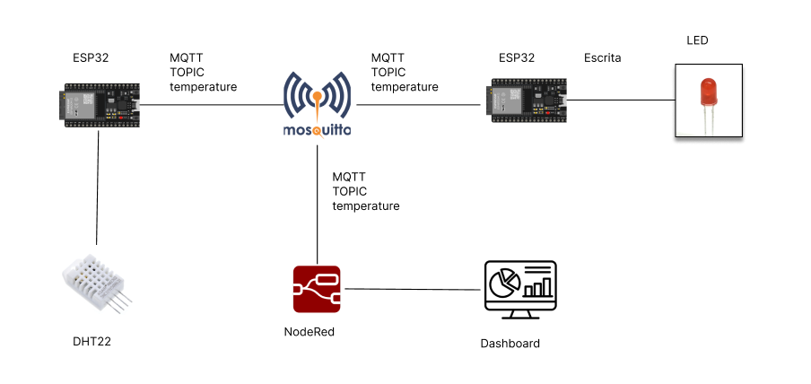

## Descrição do Projeto
Este projeto utiliza duas placas ESP32 e um sensor de temperatura DHT22 para medir a temperatura ambiente e controlar um LED. A comunicação entre as placas ESP32 é realizada através do protocolo MQTT, utilizando um broker Mosquitto público. Além disso, o Node-RED é utilizado para criar um dashboard que exibe a temperatura captada.

## Integrantes 

- Kaue Matheus Santana - RM551732;
- Gustavo René dias Boamorte - RM551288 
- João Pedro Costa Feitosa - RM98442 
- Pedro Felipe Barros da Silva - RM98093 

## Arquitetura

## Vídeo da Solução
Link: https://youtu.be/km0kCXDhtS0?si=8Hdd72nN5IADp1p1

## Funcionamento

### Publicação da Temperatura
A primeira ESP32 está conectada ao sensor de temperatura e umidade DHT22. Ela lê a temperatura do sensor e a publica em um tópico MQTT chamado `temperature` a cada 2 segundos. O código inclui:

- Conexão da ESP32 à rede Wi-Fi.
- Configuração de um cliente MQTT para publicar as leituras do sensor no tópico `temperature` de um broker Mosquitto público (`test.mosquitto.org`).
- A função `dhtSensor.getTempAndHumidity()` lê a temperatura do sensor, que é então enviada ao broker com o método `client.publish()`.

### Recepção da Temperatura e Controle do LED
A segunda ESP32 se inscreve no mesmo tópico MQTT (`temperature`) e recebe as leituras de temperatura publicadas pela primeira ESP32. Quando a temperatura recebida for superior a 30°C, o LED conectado à segunda ESP32 acende. Caso contrário, o LED permanece apagado. O funcionamento inclui:

- Conexão da ESP32 à rede Wi-Fi e ao broker MQTT.
- Função de callback que processa a mensagem recebida e extrai a temperatura.
- Comparação do valor da temperatura: se maior que 30°C, o LED é ligado; caso contrário, é desligado.

### Node-RED Dashboard
Além das placas ESP32, o sistema está conectado ao Node-RED, que é utilizado para criar um dashboard que exibe a temperatura captada em tempo real. O Node-RED consome as mensagens MQTT publicadas no tópico `temperature` e as exibe em um gráfico ou indicador visual.

## Fluxo de Dados
- **Placa 1 (Publicação):** O sensor DHT22 coleta os dados de temperatura, e a placa ESP32 publica esses dados no tópico MQTT.
- **Broker Mosquitto:** Intermediário que recebe as mensagens publicadas pela primeira ESP32 e as repassa para qualquer dispositivo inscrito no tópico.
- **Placa 2 (Recepção):** A segunda ESP32 se inscreve no tópico MQTT e, quando a temperatura recebida for maior que 30°C, acende um LED.
- **Node-RED:** O Node-RED se inscreve no mesmo tópico MQTT para exibir a temperatura captada em um dashboard de controle.

## Tecnologias Utilizadas
- **ESP32:** Microcontrolador utilizado para capturar e transmitir os dados de temperatura.
- **DHT22:** Sensor utilizado para medir temperatura e umidade.
- **MQTT:** Protocolo de comunicação para IoT usado para transmitir dados entre dispositivos.
- **Mosquitto:** Broker MQTT que faz o gerenciamento da publicação e inscrição de mensagens.
- **Node-RED:** Plataforma de automação utilizada para criar o dashboard.

## Conexões
- **Placa ESP32 1:**
  - Sensor DHT22 conectado ao pino 15.
  - Envia temperatura via MQTT para o broker.
  
- **Placa ESP32 2:**
  - LED conectado ao pino 2.
  - Recebe dados de temperatura via MQTT e controla o LED com base nos valores.

## Funcionamento

Publisher: https://wokwi.com/projects/412509708954228737
Subscriber: https://wokwi.com/projects/412509715139780609